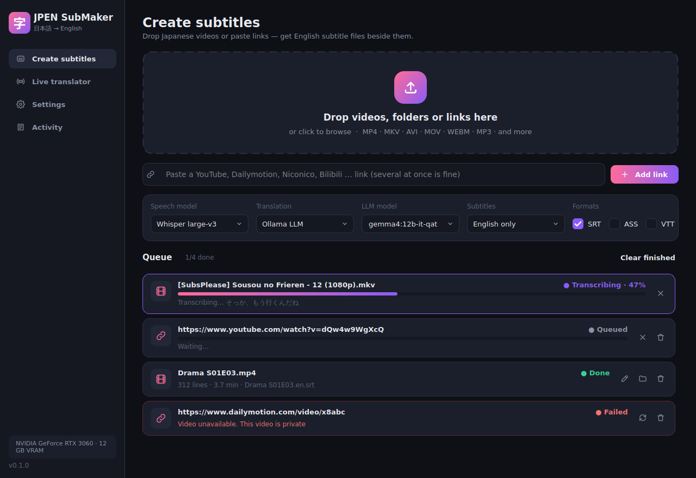
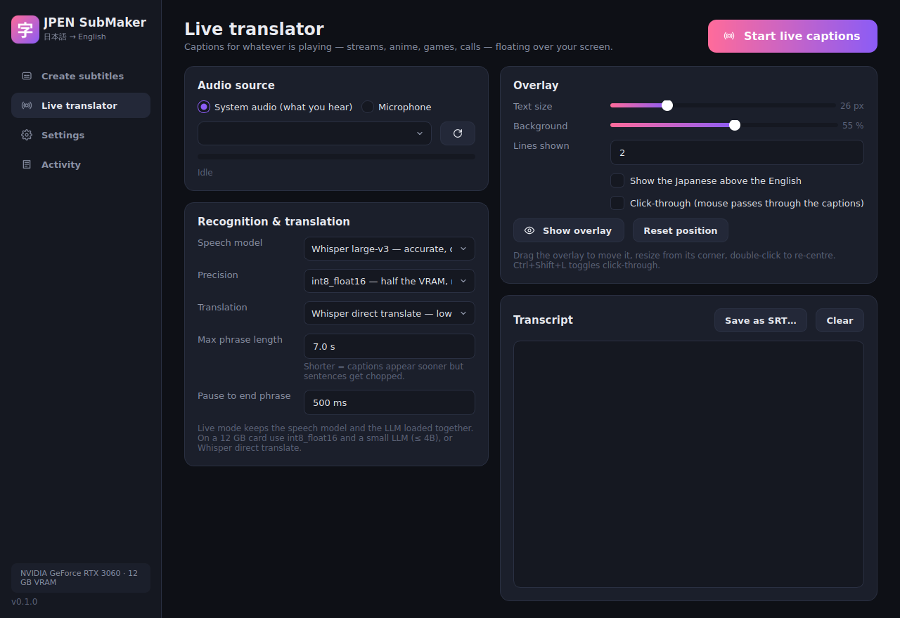

# JPEN SubMaker — Japanese → English subtitles, on your own GPU

Drop in a Japanese video (or paste a YouTube / Dailymotion / Niconico link) and get an English `.srt` next to it.
Or switch on **Live translator** and get English captions floating over whatever your PC is playing — streams,
anime, games, calls — in a transparent, always-on-top window.

Everything runs locally. It is built for an **RTX 3060 12 GB with 16 GB of RAM** and works on smaller or larger
cards too (Settings → *Apply recommended settings* picks values for your GPU).

## Download

**[⬇ JPENSubMaker-Setup.exe](https://github.com/fznx922/JPENSUBMAKER/releases/latest/download/JPENSubMaker-Setup.exe)**
— run it and you're done. No Python, no Ollama install, no command line.

On first start the app picks settings for your graphics card and offers to download the AI models in one go
(≈12 GB, once: the speech model, a private copy of the Ollama translation engine, and the translation model).
Press *Later* and each one downloads the first time it is needed instead. If Ollama is already installed, the app
uses it. A portable zip (no installer) is on the [releases page](https://github.com/fznx922/JPENSUBMAKER/releases/latest).



| Live translator | Caption overlay |
|---|---|
|  |  |

## What it does

- **Drag and drop** files or whole folders (MP4, MKV, AVI, MOV, WEBM, TS, MP3, FLAC… anything ffmpeg reads), or
  click to browse. Jobs queue up and run one after another, with progress, cancel and retry.
- **Links**: YouTube, Dailymotion, OK.ru, Niconico, Bilibili, TVer, X/Twitter and the ~1,800 other sites
  yt-dlp supports (links without `https://` are fine too). Videos that need an account can use your browser's
  sign-in (Settings → Links). Paste several at once. The video (≤1080p) is kept with its subtitles beside it, so any player loads
  them — or choose audio-only in Settings.
- **Subtitles**: English, English + Japanese (bilingual), or Japanese only, as **SRT**, **ASS** (styled; the
  Japanese sits at the top of the frame in bilingual mode) and **VTT**. Files are named `Video.en.srt` so VLC,
  mpv, MPC-HC, Plex and Jellyfin pick them up automatically.
- **Review & edit** the result in a side-by-side Japanese / English table before you watch, then save.
- **Live translator**: captures system audio directly (WASAPI loopback on Windows, PipeWire/PulseAudio monitor
  on Linux — no virtual cable) or a microphone, cuts it into phrases at pauses, and shows captions in an overlay
  you can drag, resize, make click-through (Ctrl+Shift+L or the tray icon) and style (size, background, lines,
  optional Japanese line). The session transcript can be saved as an SRT.

## The models (and why)

**Speech recognition** — pick in the app:

| model | VRAM | notes |
|---|---|---|
| **Whisper large-v3** (default) | ≈4.5 GB fp16 / ≈2.5 GB int8 | Strong Japanese, robust to noise and music, and the only option that can also translate directly. |
| **Kotoba-Whisper v2.0** | ≈1.5 GB | Distilled from large-v3 on 7.2 million clips of Japanese TV; similar accuracy on Japanese, about 6× faster. Transcription only. |
| **Qwen3-ASR 1.7B + ForcedAligner** | ≈5 GB | The lowest Japanese error rate of the open models in 2026 benchmarks, with natural punctuation. Optional install (needs PyTorch, ≈3 GB). |
| Whisper large-v3-turbo / medium / large-v2 | 1.5–4.5 GB | Faster or older alternatives. |

Any CTranslate2 Whisper model can be used by entering its folder or Hugging Face id under *Custom model* (e.g. a
fine-tuned anime model you converted with `ct2-transformers-converter`).

**Translation** — Whisper's built-in translator is fast but literal. A local LLM does much better: it gets the
lines in numbered batches of 16 with the previous lines as context, keeps names consistent, keeps the register
(casual stays casual), honours your glossary, and is retried line by line if it skips anything.

| backend | for a 12 GB card |
|---|---|
| **Ollama** (default) | `gemma4:12b-it-qat` (7.2 GB) — the model [mlsubgen](https://github.com/dodgypast/mlsubgen) measured as the best fit for 12 GB cards with 16 GB of RAM. `qwen3:14b` (≈9 GB) is a strong alternative. Any tag you have pulled works. |
| OpenAI-compatible | LM Studio, llama.cpp `llama-server`, vLLM, KoboldCpp, or a cloud API. |
| Whisper translate | No LLM needed. Lowest quality; fine for a quick gist. |

### How it fits in 12 GB

The file pipeline never holds both models at once: Whisper transcribes the whole file (≈4.5 GB), is unloaded,
then the LLM gets the card to itself (≈8–10 GB), and is unloaded again before the next file's speech model loads
(*VRAM saver* in Settings — leave it on below 20 GB). With 16 GB of system RAM, stay with LLMs that fit fully on
the card (≤ 14B at 4-bit); bigger models spill into RAM and crawl.

Live mode needs both at once, so its defaults are lighter: Whisper large-v3 in `int8_float16` (≈2.5 GB) with
Whisper direct translate, or with a small LLM like `qwen3:4b` (≈3 GB) for better English at ~1 s more latency.

## Install (Windows, from source)

Only needed if you want to run or change the Python code — the installer above is the easy way.

1. Install **Python 3.12** from [python.org](https://www.python.org/downloads/) (tick *Add python.exe to PATH*).
2. Double-click **`install_windows.bat`**, then start with **`run_windows.bat`**.
3. Optional: **`install_qwen_windows.bat`** adds the Qwen3-ASR engine (PyTorch + ≈5 GB of models; not in the .exe).

To build the .exe yourself: `pip install pyinstaller`, `pyinstaller packaging/jpensubmaker.spec`, then compile
`packaging/installer.iss` with [Inno Setup](https://jrsoftware.org/isinfo.php). GitHub Actions does exactly this on
every push (`.github/workflows/windows-build.yml`) and attaches the result to the release.

## Install (Linux)

```
git clone https://github.com/fznx922/JPENSUBMAKER && cd JPENSUBMAKER
./install.sh            # or ./install.sh --qwen
./run.sh
```
Qt needs `libxcb-cursor0` and `libegl1` (Debian/Ubuntu: `sudo apt install libxcb-cursor0 libegl1 ffmpeg`). Live
capture of system audio needs PipeWire or PulseAudio.

## Using it

- **Create subtitles**: drop files/folders on the big target, or paste links and press *Add link*. Pick the
  speech model, translator, subtitle language and formats in the bar above the queue. When a job is done: ✎ to
  review and edit, ▶ to play, 📁 to open its folder.
- **Settings → Context**: a line like *"Anime 'Frieren'. Names: Frieren, Fern, Stark, Himmel"* helps both the
  recognition and the translation. **Glossary**: `先輩 = Senpai` per line to pin renderings.
- **Live translator**: choose *System audio* (or a microphone), press **Start live captions**. Drag the overlay
  where you want it; double-click re-centres it; turn on click-through so it never steals the mouse.
- **Command line** (no GUI):
  ```
  python -m jpensubmaker --cli "D:\Anime\Episode 01.mkv" https://www.dailymotion.com/video/xxxx
  python -m jpensubmaker --cli --mode bilingual --format srt --format ass --llm qwen3:14b D:\Anime\Season1
  ```

## Troubleshooting

- **"CUDA is not available"** — update the NVIDIA driver; re-run the installer (it installs cuBLAS/cuDNN 9 as pip
  packages). As a fallback set *Device* to CPU (slow: expect several × real time).
- **Windows SmartScreen** says "unrecognised app" — the installer is not code-signed. Click *More info → Run
  anyway*.
- **Out of memory** — choose *int8_float16* precision, Kotoba-Whisper, or a smaller LLM; keep *VRAM saver* on; don't
  run live captions while a file job is running.
- **Translator problems** — Settings → *Test* translates two lines and shows any error. The app's own Ollama
  logs to `%LOCALAPPDATA%\JPENSubMaker\logs\ollama.log`. Models and the engine live in
  `%LOCALAPPDATA%\JPENSubMaker` (uninstalling removes them).
- **Repeated or invented lines over music** ("ご視聴ありがとうございました") — these well-known Whisper
  hallucinations are filtered; leave *voice activity detection* on.
- **A link fails** — the card says why. *Needs a signed-in account* (common on OK.ru): sign in on the site in
  your browser and pick that browser in Settings → Links (Firefox works best; or export a cookies.txt). *Blocked in
  your country*: the site refuses your region. Sites change often; a new release brings the latest downloader.

## Project layout

```
jpensubmaker/
  asr.py         faster-whisper and Qwen3-ASR engines, VAD chunking, timestamp repair
  cues.py        words → readable cues, hallucination filters
  translate.py   Ollama / OpenAI-compatible batch translation with context, glossary, retries
  subtitles.py   SRT / VTT / ASS writers (+ SRT reader for the editor)
  pipeline.py    file or link → subtitles, with the 12 GB VRAM plan
  realtime.py    system-audio capture, utterance segmentation, live ASR + translation
  download.py    yt-dlp
  gui/           PySide6 app: main window, overlay, editor, theme
tests/           pytest suite with a fake ASR engine and a fake LLM server
```

Run the tests with `pip install -r requirements-dev.txt && pytest`.

## Credits

[faster-whisper](https://github.com/SYSTRAN/faster-whisper) (MIT) · [Whisper](https://github.com/openai/whisper)
(MIT) · [Kotoba-Whisper](https://huggingface.co/kotoba-tech/kotoba-whisper-v2.0) (Apache-2.0) ·
[Qwen3-ASR](https://huggingface.co/Qwen/Qwen3-ASR-1.7B) (Apache-2.0) · [Silero VAD](https://github.com/snakers4/silero-vad)
(MIT) · [yt-dlp](https://github.com/yt-dlp/yt-dlp) (Unlicense) · [Ollama](https://ollama.com) ·
[soundcard](https://github.com/bastibe/SoundCard) (BSD) · [Qt for Python](https://www.qt.io/qt-for-python) (LGPL).
The model choices and the hallucination phrase list were informed by
[mlsubgen](https://github.com/dodgypast/mlsubgen). Model weights carry their own licences.
